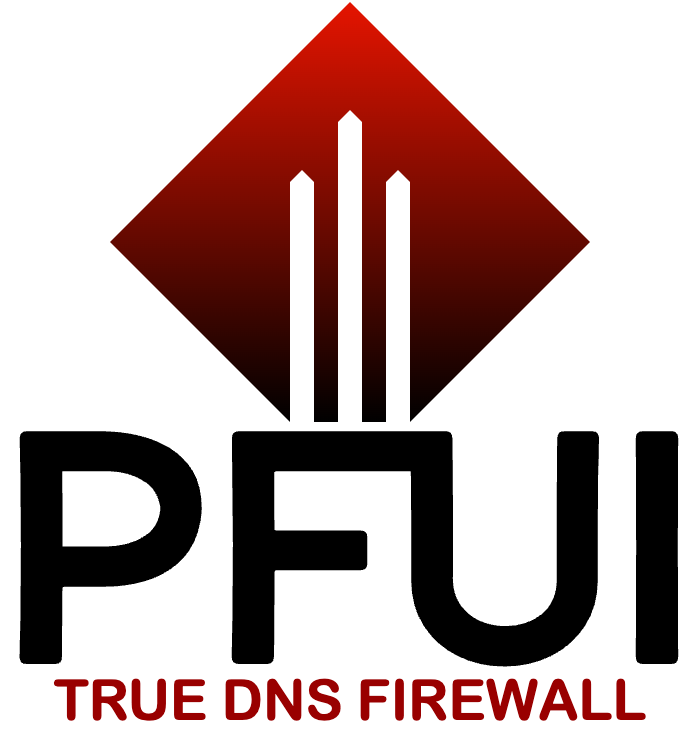
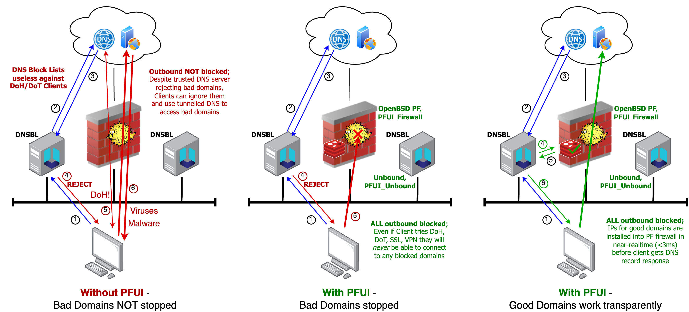

# PFUI "Default-Deny DNS-Firewall"
**PFUI (Phooey [ foo-ee ]) - `Packet Filter Unsolicited IPs` (using OpenBSD PF, Unbound and the Internet).**\
Dictionary; "an exclamation indicating disagreement or rejection".

<div style="text-align: center;">

</div>
<div style="text-align: center;">
PFUI provides a "True realtime DNS-Firewall which cannot be subverted by DoH/DoT"
</div>

*PFUI is a tool which connects OpenBSD's PF Firewall and the Unbound DNS engine, allowing to block ALL outbound user traffic by default, 
and permit connections to successfully resolved (and approved) domain names in realtime (Eg, domains not in your bad domain lists).*

PFUI works by tightly coupling the DNS resolver process into your Firewall. _All traffic can finally be 
restricted to only trusted DNS resolvers (with corporate/community DNS Blocklists) no matter what devices users have_!
Ie, Users cannot bypass an administrator's DNS blocking attempts using 'DNS over TCP/HTTPS' (DoT/DoH), or other any other tunneling technology etc.


------
## Repository layout

| Path | What it is |
|------|------------|
| [protocol/](protocol/) | The wire protocol: specification, conformance vectors, and the Python reference implementation shared by clients and servers |
| [client-unbound/](client-unbound/) | PFUI client as an Unbound pythonmod plugin |
| [server-python/](server-python/) | PFUI server for OpenBSD PF, in Python |
| [server-rust/](server-rust/) | PFUI server in Rust: a drop-in replacement for the Python daemon, validated on OpenBSD 7.9 against a live resolver and PF |
| [server-c/](server-c/) | PFUI server in C. Framing only so far |
| `install-client-unbound.sh` | Installs the Unbound client on a resolver |
| `install-server-python.sh` | Installs the Python server on a PF firewall |
| `install-server-rust.sh` | Installs the Rust server on a PF firewall (builds with the ports rustc) |
| [examples/pf.conf](examples/pf.conf) | Example PF ruleset, applies to any server implementation |

Clients and servers share only the protocol. Adding support for another resolver
means a new `client-<resolver>/`; a second server implementation means a new
`server-<language>/`. Both cases are conformance-tested against
[protocol/vectors/](protocol/vectors/) rather than against each other.

------
## PFUI Firewall comprises two parts

**"PFUI_Unbound"** - A Python3 module for [Unbound](https://nlnetlabs.nl/projects/unbound/about/) DNS resolvers;
Installed on Unbound DNS servers, forwards successful/permitted DNS responses (IPs & TTLs) to all "PFUI_Firewall" instances (Eg CARP Pair).

**"PFUI_Firewall"** - A Python3 daemon service; Installed on OpenBSD PF firewalls, receives messages from 
"PFUI_Unbound" instances, and installs permitted IPs into PF Tables (using IOCTL) and 'persist' files for use in pf.conf rules.

The "PFUI_Firewall" daemon also maintains a Redis database, to provide TTL tracking. Eg, expiries IP entries using the
original DNS resource record's TTL. And it synchronises the PF tables with the PF 'persist' files for firewall reboots.
<div style="text-align: center;">

</div>

------
## The Challenge

Traditional firewall designs allow nothing (maybe DMZ pinholes) inwards, and everything outwards by default.
To stop internal users from accessing hacked/bad/restricted sites and networks, and unwittingly bringing viruses, worms, rootkits, 
into the enterprise network, many environments implement DNS-Blocklists (DNS-BLs) on the 
corporate controlled DNS servers, to provide filtering of those bad domains.

It is also common to block UDP ports 53 and 853 ("DNS over TLS" (DoT)) outbound, from all but the corporate DNS servers, 
to force network clients to use the internal DNS (running DNS-Blocklists), as well as minimising DNS based 
Data Exfiltration. However.. since "DNS over HTTPS" (DoH), which uses the common port TCP/443 it is no longer trivial to block 
access to uncontrolled DNS name servers - 'Hold my beer' (Say's Phui).

PFUI Unbound and PFUI Firewall enforce equivalent domain based filtering a proxy provides, but perfomes the
filtering earlier at lookup time. NB; Proxies provide important functionality beyond domain filtering.

------
## A Solution

**PFUI** Changes networking practice towards _blocking all IP traffic by default_,
and using just-in-time approval, during the Domain Name Service lookup stage.
This allows to; halt DoH/DoT tunneling, stop BYOD bypasses, limit Ransomware Command and Control access, 
stop DNS exfiltration, block outbound VPNs, and impede viruses, worms and malware etc.

Good DNS settings should also ensure risks like DNS-rebinding attacks and CNAME cloaking are not possible, and Q-NAME minimisation is enabled.
PFUI enforces this independently of the resolver's configuration: only globally routable unicast
addresses are installed into the PF tables, so an answer pointing at private, loopback, link-local,
CGNAT or multicast space is refused. The example `pfui_unbound.conf` sets the matching
`private-address` ranges, and the example `pf.conf` blocks that space at the packet layer as well.
PFUI_Unbound uses Unbound's Python module interface to transmit the successfully resolved IPs (and TTL) information, 
using TCP, to OpenBSD PF Firewall(s). PFUI_Firewall then uses OpenBSD's IOCTL Kernel to update the PF tables.
NB; Since OpenBSD 7.0, IOCTL is unlocked from Kernel CPU lock (this change allowed PFUI to become production worthy).

PFUI_Unbound can notify the resolved IPs, and PFUI_Firewall can ACK (PF Table updated) in a few
milliseconds on moderate hardware (measured at 3300-4200 microseconds on an i5 with 1GbE; enable
`LOGGING` with `LOG_LEVEL: DEBUG` to measure it on your own network, and note that logging itself
adds latency). A fully recursive DNS query can take tens to hundreds of milliseconds to resolve the resource records 
(on a fast internet connection), so the delay added by PFUI is undetectable for the total client query time. And often improves overall performance due to not downloading adverts and tracking widgets.

------
## PFUI Installation
Tested on OpenBSD from 7.0 (Unbound 1.16, Python 3.8) to 7.9 (Unbound 1.26, Python 3.13).

**Re-running an installer upgrades the code and leaves your configuration
alone.** `/etc/pfui_firewall.yml`, `pfui_unbound.yml` and the resolver's own
`pfui_unbound.conf` are kept as they are, with a timestamped backup taken and
the shipped example named so you can diff it for keys added since. Only a first
install, where no config exists yet, lays down the examples.

`install-client-unbound.sh` builds the **latest Unbound release** by default: it
resolves the newest `release-*` tag from NLnet Labs at install time rather than
carrying a version in the script. Every release from 1.23 onwards is a candidate,
so pin one if you need a known build:

```
UNBOUND_VERSION=release-1.25.2 doas ./install-client-unbound.sh   # a specific release
UNBOUND_VERSION=master         doas ./install-client-unbound.sh   # upstream head
```

Unbound 1.26.0 with `--with-pythonmodule` is built and exercised on every commit;
see [Tests](#tests).

### 1) Install PFUI_Firewall on OpenBSD PF Firewall(s)
```
pkg_add bash
git clone https://github.com/andylemin/PFUI.git && cd PFUI
doas ./install-server-rust.sh
```
The Rust daemon is the default: one binary on the firewall, with no interpreter
and no Python packages to keep in step with it. It builds with the rustc in
ports, which the installer adds, or installs a binary you built elsewhere with
`PFUI_BINARY=/path/to/pfui_firewall`.

Where Rust is unavailable, `doas ./install-server-python.sh` installs the
Python daemon instead. Both read the same `/etc/pfui_firewall.yml` and share
the Redis schema, so either can take over from the other; they are mutually
exclusive on one firewall, using the same binary path and service name.
* 1b) Now add IP Reputation Block Lists to PF Firewalls (optional/recommended);\
https://www.geoghegan.ca/pfbadhost.html \
https://www.geoghegan.ca/pub/pf-badhost/latest/man/man.txt

For high Qps rates, we need to increase OpenBSD's max-threads-per-proc
Apply now, and add the same lines to `/etc/sysctl.conf` so they survive a reboot
(runtime `sysctl` is not persistent):
```
sysctl kern.maxthread=8000  # OpenBSD
sysctl kern.somaxconn=1024
sysctl net.inet.tcp.ackonpush=1
```

### 2) Install PFUI_Unbound on Internal Unbound DNS Server(s)
```
pkg_add bash
git clone https://github.com/andylemin/PFUI.git && cd PFUI
doas ./install-client-unbound.sh
```
Note the following lines in the example Unbound `/var/unbound/etc/pfui_unbound.conf` file after install (copy these to your own Unbound config or use the example);
```
    module-config: "validator python iterator"

python:
    python-script: "/var/unbound/etc/pfui_unbound.py"

remote-control:
    control-enable: yes
    control-interface: /var/run/unbound.sock
```
* 2b) Now add [Domain Reputation Block Lists](#unboundadblock) for Unbound DNS servers (optional/recommended);\
Eg `PFUI <> Unbound < unbound-adblock`
https://www.geoghegan.ca/unbound-adblock.html &
https://geoghegan.ca/pub/unbound-adblock/0.5/man/man.txt.
See [Unbound-Adblock](#unboundadblock) section

For high Qps rates (>1000 Qps) increase the max-procs and max-threads-per-proc.
If you have a slow/long internet connection (query threads persist longer) then increasing these may still be useful
Again, add these to `/etc/sysctl.conf` as well as applying them:
```
sysctl kern.maxproc=8000
sysctl kern.maxthread=8000
sysctl kern.somaxconn=1024
sysctl net.inet.tcp.ackonpush=1
```
You can monitor Unbound with 'unbound-control status' & 'unbound-control stats'


------
<a name="unboundadblock"></a>
### 2b) Unbound-Adblock (example DNS Domain BlockList Manager)
Using Jordan's Bad Domain Block Lists manager (https://www.geoghegan.ca/unbound-adblock.html).


Jordan has done a great job creating a comprehensive bad domains downloader which is highly customisable.
His last version (0.5) switched to using RPZ (Response Policy Zones) by default, so we have to make some minor changes.
"Response Policy Zones (RPZ) is a mechanism which makes it possible to define your local policies in a standardised 
way and load your policies from external sources" (https://unbound.docs.nlnetlabs.nl/en/latest/topics/filtering/rpz.html). It is used through the RESPIP module.

_As of Unbound 1.8.0, it is not possible to use both PythonModule and RESPIP Module in Unbound concurrently_. 
Until this is resolved, the following steps provide a workaround.
TODO; Open bug/feature request with Unbound to support RESPIP and Pythonmod concurrently.

So don't add the the RPZ config in Jordan's install guides.
Install Jordan's unbound-adblock tool to use 'file blocklists' over 'RPZ';
```
cd /tmp
ftp https://geoghegan.ca/pub/unbound-adblock/0.5/unbound-adblock.sh
useradd -s /sbin/nologin -d /var/empty _adblock
install -m 755 -o root -g bin unbound-adblock.sh /usr/local/bin/unbound-adblock
install -m 644 -o _adblock -g wheel /dev/null /var/unbound/db/adblock.conf
pkg_add ripgrep mawk  # If you get Seg faults, try uninstalling/without mawk
install -d -o root -g wheel -m 755 /var/log/unbound-adblock
install -o _adblock -g wheel -m 640 /dev/null /var/log/unbound-adblock/unbound-adblock.log
install -o _adblock -g wheel -m 640 /dev/null /var/log/unbound-adblock/unbound-adblock.log.0.gz
unbound-control-setup
```

Add the following to /etc/doas.conf (provide permissions under cron);
```
permit root
permit nopass _adblock cmd /usr/sbin/unbound-control args -q status
permit nopass _adblock cmd /usr/sbin/unbound-control args -q flush_zone unbound-adblock
permit nopass _adblock cmd /usr/sbin/unbound-control args -q auth_zone_reload unbound-adblock
# Only needed if using old unbound specific 'local-data' backend with '-o unbound'
permit nopass _adblock cmd /usr/sbin/rcctl args reload unbound
# PFUI Unbound Daemon with file domain list
permit nopass _adblock cmd /usr/sbin/rcctl args reload pfui_unbound
permit nopass _adblock cmd /usr/sbin/unbound-control args reload
```

Make some minor changes to Jordan's script to use our new PFUI Unbound service name (`pfui_unbound`)
```
sed -i -e 's/check unbound/check pfui_unbound/g' /usr/local/bin/unbound-adblock
sed -i -e "s/rcdarg2='unbound'/rcdarg2='pfui_unbound'/g" /usr/local/bin/unbound-adblock
```

Test unbound-adblock manually. Run Jordan's unbound-adblock tool with the following arguments to generate an Unbound list-format blocklist
```
doas -u _adblock unbound-adblock -O openbsd -o unbound -W /var/unbound/db/adblock.conf
```
Add the following line to `/var/unbound/etc/pfui_unbound.conf` before the `python:` and forwarders section, instead of the suggested RPZ config, to load the list-format file.
```
include: /var/unbound/db/adblock.conf
```
Restart PFUI_Unbound to load the new DNS Bad Domains list
```
rcctl restart pfui_unbound
```
Edit _adblock user's crontab to; execute 'unbound-adblock' every night (`crontab -u _adblock -e`):
```
~ 0~1 * * * -s unbound-adblock -O openbsd -o unbound -W /var/unbound/db/adblock.conf
```
Edit _unbound user's crontab to; import domain lists / execute 'unbound-control reload' after unbound-adblock (`crontab -u _unbound -e`):
```
~ 1~2 * * * unbound-control -c /var/unbound/etc/pfui_unbound.conf reload_keep_cache
```
NB; If you want to keep the `unbound-control` cron commands under the _adblock user, you will need to add _adblock to _unbound group.

Jordan's unbound-adblock installation guide for reference;\
https://www.geoghegan.ca/pub/unbound-adblock/latest/install/openbsd.txt \
https://www.geoghegan.ca/pub/pf-badhost/latest/man/man.txt

------
<a name="tests"></a>
### Tests;

```
pytest                                        # protocol, client and server suites
make -C server-c test                         # the C framing against the shared vectors
./client-unbound/tests/container/run.sh       # builds Unbound and runs PFUI_Unbound in it
```

The PF ioctl suites skip unless they are run on OpenBSD, and
`client-unbound/tests/test_unbound*.py`'s live cases skip unless `PFUI_FW_HOST`
points at a running PFUI_Firewall.

The container is the one test that builds Unbound from source with
`--with-pythonmodule` and runs the real resolver against a local authoritative
server and a stub firewall. No distribution packages Unbound with the Python
module, so that build is PFUI's alone, and pythonmod API drift in a new Unbound
release would otherwise only show up when someone ran the installer. It takes a
few minutes and needs Docker; nothing runs on the host. CI runs it against the
latest release, and against upstream `master` for information only.

------
<a name="configexamples"></a>
### Configuration examples;

Two transports carry the same messages and the same replies. Pick per firewall:
a **TCP socket** when the resolver is on another machine, a **unix socket** when
it is on the firewall itself. A resolver can use both at once.

#### TCP socket — resolver on another host

Firewall, `/etc/pfui_firewall.yml`:
```yaml
LOGGING: False
LOG_LEVEL: ERROR
SOCKET_LISTEN: 10.10.1.254    # inside interface IP, never 0.0.0.0
SOCKET_PROTO: TCP
SOCKET_PORT: 10001
COMPRESS: True                # must match the resolver
REDIS_HOST: 127.0.0.1
REDIS_PORT: 6379
REDIS_DB: 0
SCAN_PERIOD: 60
TTL_MULTIPLIER: 4
CTL: IOCTL
DEVPF: /dev/pf
AF4_TABLE: pfui_ipv4_domains
AF4_FILE: /var/db/pfui/ipv4_domains
AF6_TABLE: pfui_ipv6_domains
AF6_FILE: /var/db/pfui/ipv6_domains
```

Resolver, `/var/unbound/etc/pfui_unbound.yml`:
```yaml
LOGGING: False
LOG_LEVEL: ERROR
SOCKET_PROTO: TCP
SOCKET_TIMEOUT: 3
COMPRESS: True                # must match the firewall
BLOCKING: True                # hold the answer until the IPs are in the table
DEFAULT_PORT: 10001
FIREWALLS:
  - HOST: 10.10.1.254
    PORT: 10001
```

This transport is unauthenticated, so restrict the port to the known resolvers
in `pf.conf`:
```
pass in quick on $if_inside proto tcp from <int_dns> to (self) port { 10001 }
```

#### Unix socket — resolver on the firewall itself

Faster than loopback TCP, because the client opens one connection per DNS
answer: no handshake, no `TIME_WAIT` entry, no ephemeral port per reply. It also
needs no `pf.conf` rule, because there is no packet to filter.

Firewall, `/etc/pfui_firewall.yml` — as above, but with the socket added and
`SOCKET_LISTEN` omitted if no remote resolver needs this firewall:
```yaml
LOGGING: False
LOG_LEVEL: ERROR
SOCKET_UNIX: /var/run/pfui/pfui_firewall.sock
SOCKET_UNIX_GROUP: _pfui      # the resolver's account must be a member
COMPRESS: True
REDIS_HOST: 127.0.0.1
REDIS_PORT: 6379
REDIS_DB: 0
SCAN_PERIOD: 60
TTL_MULTIPLIER: 4
CTL: IOCTL
DEVPF: /dev/pf
AF4_TABLE: pfui_ipv4_domains
AF4_FILE: /var/db/pfui/ipv4_domains
AF6_TABLE: pfui_ipv6_domains
AF6_FILE: /var/db/pfui/ipv6_domains
```

Resolver, `/var/unbound/etc/pfui_unbound.yml`:
```yaml
LOGGING: False
LOG_LEVEL: ERROR
SOCKET_TIMEOUT: 3
COMPRESS: True
BLOCKING: True
FIREWALLS:
  - SOCKET: /var/run/pfui/pfui_firewall.sock
```

Access control is the filesystem here rather than PF: see
[Same-host deployment](#samehost).

#### Both at once — a CARP node with its own resolver

The firewall serves the socket and the network listener together, and the
resolver names one entry per firewall. `SOCKET_PROTO` applies only to the
`HOST` entries.

Firewall: set both `SOCKET_UNIX` and `SOCKET_LISTEN`. Resolver:
```yaml
FIREWALLS:
  - SOCKET: /var/run/pfui/pfui_firewall.sock   # this host, over the local socket
  - HOST: 10.10.1.253                          # the CARP peer, over the network
    PORT: 10001
```

Every key not shown takes its default; both daemons list them with comments in
[server-python/pfui_firewall.yml](server-python/pfui_firewall.yml) and
[client-unbound/pfui_unbound.yml](client-unbound/pfui_unbound.yml).

------
<a name="samehost"></a>
### Same-host deployment (local socket);

When PFUI_Unbound and PFUI_Firewall run on the **same machine**, the resolver can
reach the firewall over a unix domain socket instead of loopback TCP. The client
opens one connection per DNS answer, so loopback TCP costs a handshake, a
`TIME_WAIT` entry on the firewall and an ephemeral port for every reply; a local
socket costs none of them, and needs no `pf.conf` rule because there is no packet
to filter.

On the firewall, in `/etc/pfui_firewall.yml`:
```
SOCKET_UNIX: /var/run/pfui/pfui_firewall.sock
SOCKET_UNIX_GROUP: _pfui
# SOCKET_LISTEN may be omitted entirely if no remote resolver needs to reach this
# firewall. Keep it to serve both, which is what a CARP node wants.
```
On the resolver, in `/var/unbound/etc/pfui_unbound.yml`:
```
FIREWALLS:
  - SOCKET: /var/run/pfui/pfui_firewall.sock   # this host, over the local socket
  - HOST: 10.10.1.253                          # the CARP peer, over the network
    PORT: 10001
```
The transport is per entry, so one resolver can use both at once. `SOCKET_PROTO`
applies only to the `HOST` entries.

**Access control moves from PF to the filesystem.** The socket is `0660`, owned by
group `_pfui`, inside a directory only that group may traverse, and the resolver's
account (`_unbound`) must be a member — so membership of `_pfui` is what authorises
injecting PF whitelist entries. Both installers manage the group:
`install-server-python.sh` creates it, and `install-client-unbound.sh` adds
`_unbound` to it when it finds a firewall installed on the same host. **Unbound
must be restarted** for a new group membership to take effect; a resolver that is
not in the group fails to connect with `EACCES`.

If the firewall is on a different machine, none of this applies: use `HOST` and
restrict the listening port in `pf.conf` as before.

------
### Compatibility;

Supports IPv4 and IPv6.

PFUI_Unbound - Supports anything Unbound does (Linux, BSD, etc), requires Python 3.

PFUI_Firewall - Supports OpenBSD (FreeBSD still in alpha), requires Python 3.


------
### Known Issues;

Unbound with PFUI_Firewall - Does **not** currently support running Unbound with 'chroot'. TODO Python dependencies must
also reside in the jail. Virtualenv planned for PFUI release candidate.

pfui_firewall.py (/usr/local/sbin/pfui_firewall) - uses an excplicit '#!/usr/local/bin/python3' hash-bang rather than
usual 'env python3' to occasional boot autostart sequeunce issues.

Some browsers tend to cache DNS responses longer than the DNS RRs TTL value! This is bad practice and causes issues
as websites change IPs for many reasons. `about:config`, set `network.dnsCacheExpiration = 0` to disable the Firefox internal DNS cache (use resolvers cache).
Additionally DNS RR's TTL windows (idle without query refreshes) may be increased using `TTL_MULTIPLIER` in pfui_firewall.yml to permit traffic for longer without a DNS refresh.


------
### Recommendations;

- It is recommended to configure PF to only allow connections to PFUI_Firewall's listening port
from the trusted Unbound DNS servers running PFUI_Unbound (see examples `pf.conf`).
PFUI does not implement authentication or encryption yet for performance reasons - resolved/allowed IPs must be installed into PF Tables microseconds _before_ the client connects to those IPs).

- It is NEVER recommended to allow all TCP/UDP ports out by default.. Only allow ports to known wanted applications.
If you have services that require random ports, host them on dedicated hosts which are allowed any port. General users
should not have need to access random/uncommon destination ports on corporate environments.

- To ensure local firewall traffic can flow, block connections from clients to IPs NOT in the permit list (PF Table) on the inside interface.
This will avoid issues with local firewall services, which are assumed to be trusted.


------
### Docs;
The Unbound "Python Module" [documentation](client-unbound/docs.pythonmod/index.html) has been included here for reference 
(requires compiling from source) and all rights remain with Unbound arthor's Nlnetlabs.
The Python Module documentation for Unbound was built with SWIG on: Sep 3 13:18 2019


------
### Similar Projects;
https://github.com/wupeka/dnsfire - PFUI is similar to DNSFire, where PFUI is for Unbound and PF, rather than BIND and IPSET


TODO; Add instructions for installing PFUI_Unbound on PiHole 
