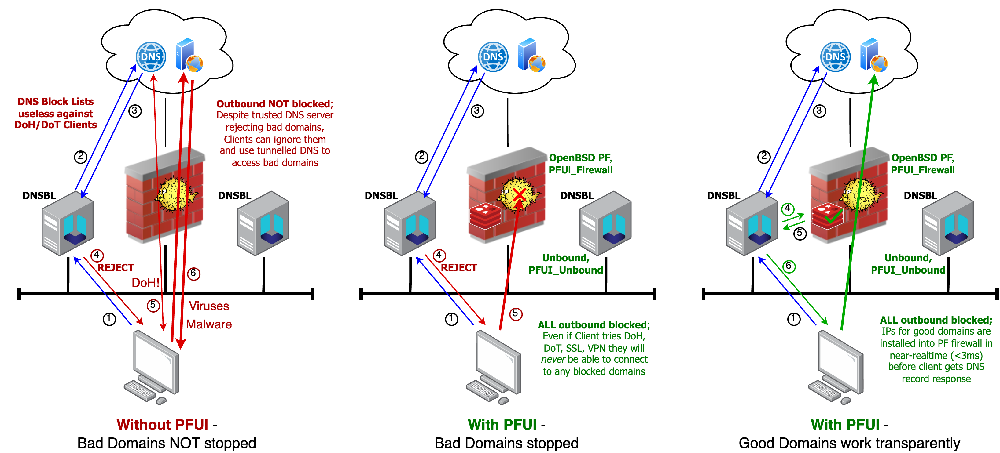

# PFUI "Default-Deny DNS-Firewall"
**PFUI (Phooey [ foo-ee ]) - `Packet Filter Unsolicited IPs` (using OpenBSD PF, Unbound and the Internet).**\
Dictionary; "an exclamation indicating disagreement or rejection".

<div style="text-align: center;">

</div>
<div style="text-align: center;">
PFUI provides a "True realtime DNS-Firewall which cannot be subverted by DoH/DoT"
</div>

*PFUI is a tool which connects OpenBSD's PF Firewall and the Unbound DNS engine, allowing to block ALL outbound user traffic by default, 
and permit connections to successfully resolved (and approved) domain names in realtime (Eg, domains not in your bad domain lists).*

PFUI works by tightly coupling the DNS resolver process into your Firewall. _All traffic can finally be 
restricted to only trusted DNS resolvers (with corporate/community DNS Blocklists) no matter what devices users have_!
Ie, Users cannot bypass an administrator's DNS blocking attempts using 'DNS over TCP/HTTPS' (DoT/DoH), or other any other tunneling technology etc.


------
## PFUI Firewall comprises two parts

**"PFUI_Unbound"** - A Python3 module for [Unbound](https://nlnetlabs.nl/projects/unbound/about/) DNS resolvers;
Installed on Unbound DNS servers, forwards successful/permitted DNS responses (IPs & TTLs) to all "PFUI_Firewall" instances (Eg CARP Pair).

**"PFUI_Firewall"** - A Python3 daemon service; Installed on OpenBSD PF firewalls, receives messages from 
"PFUI_Unbound" instances, and installs permitted IPs into PF Tables (using IOCTL) and 'persist' files for use in pf.conf rules.

The "PFUI_Firewall" daemon also maintains a Redis database, to provide TTL tracking. Eg, expiries IP entries using the
original DNS resource record's TTL. And it synchronises the PF tables with the PF 'persist' files for firewall reboots.
<div style="text-align: center;">

</div>

------
## The Challenge

Traditional firewall designs allow nothing (maybe DMZ pinholes) inwards, and everything outwards by default.
To stop internal users from accessing hacked/bad/restricted sites and networks, and unwittingly bringing viruses, worms, rootkits, 
into the enterprise network, many environments implement DNS-Blocklists (DNS-BLs) on the 
corporate controlled DNS servers, to provide filtering of those bad domains.

It is also common to block UDP ports 53 and 853 ("DNS over TLS" (DoT)) outbound, from all but the corporate DNS servers, 
to force network clients to use the internal DNS (running DNS-Blocklists), as well as minimising DNS based 
Data Exfiltration. However.. since "DNS over HTTPS" (DoH), which uses the common port TCP/443 it is no longer trivial to block 
access to uncontrolled DNS name servers - 'Hold my beer' (Say's Phui).

PFUI Unbound and PFUI Firewall enforce equivalent domain based filtering a proxy provides, but perfomes the
filtering earlier at lookup time. NB; Proxies provide important functionality beyond domain filtering.

------
## A Solution

**PFUI** Changes networking practice towards _blocking all IP traffic by default_,
and using just-in-time approval, during the Domain Name Service lookup stage.
This allows to; halt DoH/DoT tunneling, stop BYOD bypasses, limit Ransomware Command and Control access, 
stop DNS exfiltration, block outbound VPNs, and impede viruses, worms and malware etc.

Good DNS settings should also ensure risks like DNS-rebinding attacks and CNAME cloaking are not possible, and Q-NAME minimisation is enabled.
PFUI_Unbound uses Unbound's Python module interface to transmit the successfully resolved IPs (and TTL) information, 
using TCP, to OpenBSD PF Firewall(s). PFUI_Firewall then uses OpenBSD's IOCTL Kernel to update the PF tables.
NB; Since OpenBSD 7.0, IOCTL is unlocked from Kernel CPU lock (this change allowed PFUI to become production worthy).

PFUI_Unbound can notify the resolved IPs, and PFUI_Firewall can ACK (PF Table updated) in around 1ms, 
on moderate i7 hardware. A fully recursive DNS query can take tens to hundreds of milliseconds to resolve the resource records 
(on a fast internet connection), so the delay added by PFUI is undetectable for the total client query time. And often improves overall performance due to not downloading adverts and tracking widgets.

------
## PFUI Installation
Tested from OpenBSD 7.0, Unbound 1.16, Python 3.8,
up to OpenBSD 7.4, Unbound 1.18, Python 3.10

### 1) Install PFUI_Firewall on OpenBSD PF Firewall(s)
```
pkg_add bash
pfui_firewall_install.sh
```
* 1b) Now add IP Reputation Block Lists to PF Firewalls (optional/recommended);\
https://www.geoghegan.ca/pfbadhost.html \
https://www.geoghegan.ca/pub/pf-badhost/latest/man/man.txt

For high Qps rates, we need to increase OpenBSD's max-threads-per-proc
```
sysctl kern.maxthread=8000  # OpenBSD
sysctl kern.somaxconn=1024
sysctl net.inet.tcp.ackonpush=1
```

### 2) Install PFUI_Unbound on Internal Unbound DNS Server(s)
```
pkg_add bash
pfui_unbound_install.sh
```
Note the following lines in the example Unbound `/var/unbound/etc/pfui_unbound.conf` file after install (copy these to your own Unbound config or use the example);
```
    module-config: "validator python iterator"

python:
    python-script: "/var/unbound/etc/pfui_unbound.py"

remote-control:
    control-enable: yes
    control-interface: /var/run/unbound.sock
```
* 2b) Now add [Domain Reputation Block Lists](#unboundadblock) for Unbound DNS servers (optional/recommended);\
Eg `PFUI <> Unbound < unbound-adblock`
https://www.geoghegan.ca/unbound-adblock.html &
https://geoghegan.ca/pub/unbound-adblock/0.5/man/man.txt.
See [Unbound-Adblock](#unboundadblock) section

For high Qps rates (>1000 Qps) increase the max-procs and max-threads-per-proc.
If you have a slow/long internet connection (query threads persist longer) then increasing these may still be useful
```
sysctl kern.maxproc=8000
sysctl kern.maxthread=8000
sysctl kern.somaxconn=1024
sysctl net.inet.tcp.ackonpush=1
```
You can monitor Unbound with 'unbound-control status' & 'unbound-control stats'


------
<a name="unboundadblock"></a>
### 2b) Unbound-Adblock (example DNS Domain BlockList Manager)
Using Jordan's Bad Domain Block Lists manager (https://www.geoghegan.ca/unbound-adblock.html).


Jordan has done a great job creating a comprehensive bad domains downloader which is highly customisable.
His last version (0.5) switched to using RPZ (Response Policy Zones) by default, so we have to make some minor changes.
"Response Policy Zones (RPZ) is a mechanism which makes it possible to define your local policies in a standardised 
way and load your policies from external sources" (https://unbound.docs.nlnetlabs.nl/en/latest/topics/filtering/rpz.html). It is used through the RESPIP module.

_As of Unbound 1.8.0, it is not possible to use both PythonModule and RESPIP Module in Unbound concurrently_. 
Until this is resolved, the following steps provide a workaround.
TODO; Open bug/feature request with Unbound to support RESPIP and Pythonmod concurrently.

So don't add the the RPZ config in Jordan's install guides.
Install Jordan's unbound-adblock tool to use 'file blocklists' over 'RPZ';
```
cd /tmp
ftp https://geoghegan.ca/pub/unbound-adblock/0.5/unbound-adblock.sh
useradd -s /sbin/nologin -d /var/empty _adblock
install -m 755 -o root -g bin unbound-adblock.sh /usr/local/bin/unbound-adblock
install -m 644 -o _adblock -g wheel /dev/null /var/unbound/db/adblock.conf
pkg_add ripgrep mawk  # If you get Seg faults, try uninstalling/without mawk
install -d -o root -g wheel -m 755 /var/log/unbound-adblock
install -o _adblock -g wheel -m 640 /dev/null /var/log/unbound-adblock/unbound-adblock.log
install -o _adblock -g wheel -m 640 /dev/null /var/log/unbound-adblock/unbound-adblock.log.0.gz
unbound-control-setup
```

Add the following to /etc/doas.conf (provide permissions under cron);
```
permit root
permit nopass _adblock cmd /usr/sbin/unbound-control args -q status
permit nopass _adblock cmd /usr/sbin/unbound-control args -q flush_zone unbound-adblock
permit nopass _adblock cmd /usr/sbin/unbound-control args -q auth_zone_reload unbound-adblock
# Only needed if using old unbound specific 'local-data' backend with '-o unbound'
permit nopass _adblock cmd /usr/sbin/rcctl args reload unbound
# PFUI Unbound Daemon with file domain list
permit nopass _adblock cmd /usr/sbin/rcctl args reload pfui_unbound
permit nopass _adblock cmd /usr/sbin/unbound-control args reload
```

Make some minor changes to Jordan's script to use our new PFUI Unbound service name (`pfui_unbound`)
```
sed -i -e 's/check unbound/check pfui_unbound/g' /usr/local/bin/unbound-adblock
sed -i -e "s/rcdarg2='unbound'/rcdarg2='pfui_unbound'/g" /usr/local/bin/unbound-adblock
```

Test unbound-adblock manually. Run Jordan's unbound-adblock tool with the following arguments to generate an Unbound list-format blocklist
```
doas -u _adblock unbound-adblock -O openbsd -o unbound -W /var/unbound/db/adblock.conf
```
Add the following line to `/var/unbound/etc/pfui_unbound.conf` before the `python:` and forwarders section, instead of the suggested RPZ config, to load the list-format file.
```
include: /var/unbound/db/adblock.conf
```
Restart PFUI_Unbound to load the new DNS Bad Domains list
```
rcctl restart pfui_unbound
```
Edit _adblock user's crontab to; execute 'unbound-adblock' every night (`crontab -u _adblock -e`):
```
~ 0~1 * * * -s unbound-adblock -O openbsd -o unbound -W /var/unbound/db/adblock.conf
```
Edit _unbound user's crontab to; import domain lists / execute 'unbound-control reload' after unbound-adblock (`crontab -u _unbound -e`):
```
~ 1~2 * * * unbound-control -c /var/unbound/etc/pfui_unbound.conf reload_keep_cache
```
NB; If you want to keep the `unbound-control` cron commands under the _adblock user, you will need to add _adblock to _unbound group.

Jordan's unbound-adblock installation guide for reference;\
https://www.geoghegan.ca/pub/unbound-adblock/latest/install/openbsd.txt \
https://www.geoghegan.ca/pub/pf-badhost/latest/man/man.txt

------
### Compatibility;

Supports IPv4 and IPv6.

PFUI_Unbound - Supports anything Unbound does (Linux, BSD, etc), requires Python 3.

PFUI_Firewall - Supports OpenBSD (FreeBSD still in alpha), requires Python 3.


------
### Known Issues;

Unbound with PFUI_Firewall - Does **not** currently support running Unbound with 'chroot'. TODO Python dependencies must
also reside in the jail. Virtualenv planned for PFUI release candidate.

pfui_firewall.sh (/usr/local/sbin/pfui_firewall) - uses an excplicit '#!/usr/local/bin/python3' hash-bang rather than
usual 'env python3' to occasional boot autostart sequeunce issues.

Some browsers tend to cache DNS responses longer than the DNS RRs TTL value! This is bad practice and causes issues
as websites change IPs for many reasons. `about:config`, set `network.dnsCacheExpiration = 0` to disable the Firefox internal DNS cache (use resolvers cache).
Additionally DNS RR's TTL windows (idle without query refreshes) may be increased using `TTL_MULTIPLIER` in pfui_firewall.yml to permit traffic for longer without a DNS refresh.


------
### Recommendations;

- It is recommended to configure PF to only allow connections to PFUI_Firewall's listening port
from the trusted Unbound DNS servers running PFUI_Unbound (see examples `pf.conf`).
PFUI does not implement authentication or encryption yet for performance reasons - resolved/allowed IPs must be installed into PF Tables microseconds _before_ the client connects to those IPs).

- It is NEVER recommended to allow all TCP/UDP ports out by default.. Only allow ports to known wanted applications.
If you have services that require random ports, host them on dedicated hosts which are allowed any port. General users
should not have need to access random/uncommon destination ports on corporate environments.

- To ensure local firewall traffic can flow, block connections from clients to IPs NOT in the permit list (PF Table) on the inside interface.
This will avoid issues with local firewall services, which are assumed to be trusted.


------
### Docs;
The Unbound "Python Module" [documentation](docs.html.pythonmod/index.html) has been included here for reference 
(requires compiling from source) and all rights remain with Unbound arthor's Nlnetlabs.
The Python Module documentation for Unbound was built with SWIG on: Sep 3 13:18 2019


------
### Similar Projects;
https://github.com/wupeka/dnsfire - PFUI is similar to DNSFire, where PFUI is for Unbound and PF, rather than BIND and IPSET


TODO; Add instructions for installing PFUI_Unbound on PiHole 
